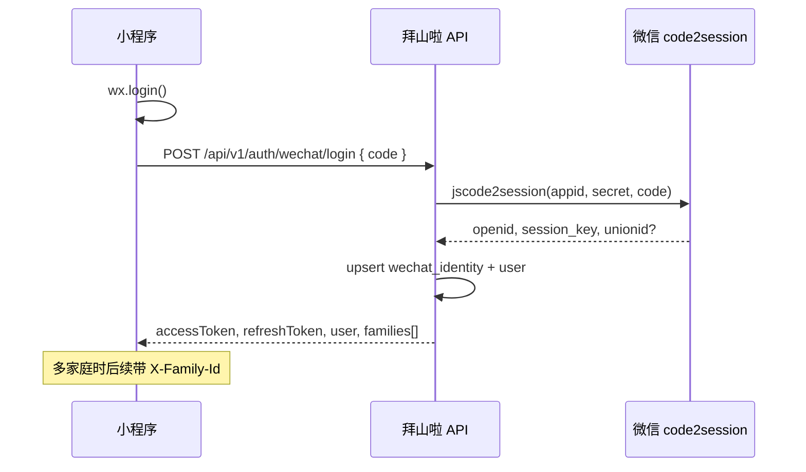
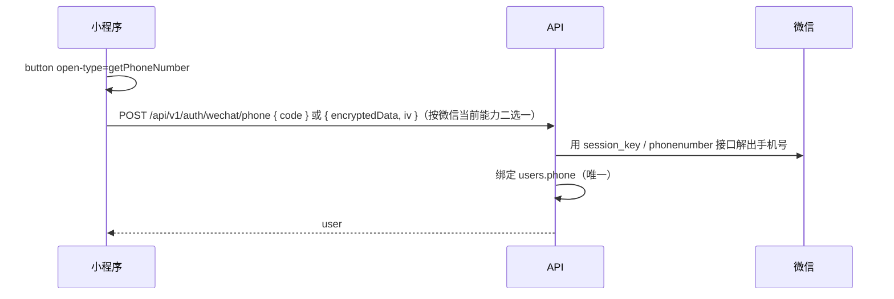

# 拜山啦 · 微信登录设计（code2session）

| 项 | 内容 |
|---|---|
| 文档 | BAISHANLA-BE-AUTH-001 |
| 对应 | 上线里程碑 2026-11 小程序地基；技术方案 Identity 模块 |
| 版本 | B/0 |
| 日期 | 2026-09-12 |
| 状态 | 设计稿 · 待脚手架后落地 |
| 非目标 | 聚家；H5 OTP 主路径（仅作联调/评审备胎） |

---

## 1. 目标

小程序用户用微信身份进入拜山啦，服务端建立可审计会话，前端不接触 `session_key`。支持：

1. 静默登录（`wx.login` → `code`）
2. 可选绑定手机号（`getPhoneNumber`，补充资料/风控）
3. 家庭上下文切换（`X-Family-Id`，与技术方案一致）
4. 为后续订阅消息预留 `openid` 绑定

## 2. 信任边界

| 秘密 | 存放 | 客户端可见 |
|---|---|---|
| `appid` / `secret` | 仅服务端配置 | 否 |
| `session_key` | 服务端加密或哈希旁路存储（见下） | **否** |
| `openid` / `unionid` | `users` / `wechat_identities` | 否（API 不回传） |
| 我方 JWT access / refresh | 客户端安全存储 | access 短时可用 |

`session_key` 用途：解密手机号等微信回包、校验部分签名。MVP：**落库加密字段**（KMS/本地密钥），轮换时重登即可；不做长期依赖签名的业务。

## 3. 时序



可选手机号：



> 实现时以微信当前文档为准：新版推荐 `getPhoneNumber` 返回的一次性 `code` 调服务端换号接口，优于旧版 encryptedData。

## 4. 数据

### wechat_identities

| 列 | 类型 | 说明 |
|---|---|---|
| id | uuid PK | |
| user_id | uuid FK | |
| app_id | varchar(32) | 小程序 appid（多端预留） |
| openid | varchar(64) | 唯一 `(app_id, openid)` |
| unionid | varchar(64) null | 有则唯一 |
| session_key_enc | bytea null | 加密后的 session_key；可空若仅 JWT |
| session_key_updated_at | timestamptz | |
| created_at / updated_at | timestamptz | |

### users（相对技术方案增量）

| 列 | 变更 |
|---|---|
| phone | 可空；微信登录后可后补 |
| wx_nickname / avatar 初值 | 来自用户授权头像昵称（若有）；默认可生成「拜山用户xxxx」 |
| last_login_at | 每次 login 更新 |

### refresh_tokens

沿用技术方案：旋转刷新、可吊销；绑定 `user_id` + 设备指纹可选。

## 5. API

前缀 `/api/v1`。统一包体 `{ ok, data, error, requestId }`。

| Method | Path | Body | 说明 |
|---|---|---|---|
| POST | `/auth/wechat/login` | `{ code: string }` | code2session；返回 tokens + user + families |
| POST | `/auth/wechat/phone` | `{ code: string }` | 需已登录；绑定手机号 |
| POST | `/auth/refresh` | `{ refreshToken }` | 旋转 |
| POST | `/auth/logout` | — | 作废当前 refresh |
| GET | `/me` | — | |
| PATCH | `/me` | nickname, avatarUrl, timezone | |

### 登录成功 `data` 形状（草）

```json
{
  "accessToken": "...",
  "refreshToken": "...",
  "expiresIn": 900,
  "user": {
    "id": "uuid",
    "nickname": "…",
    "avatarUrl": null,
    "phoneBound": false,
    "timezone": "Asia/Shanghai"
  },
  "families": [
    { "id": "uuid", "name": "王家", "role": "owner", "theme": "spring_qingming" }
  ]
}
```

无家庭：小程序进 B1「创建/加入」；`families: []`。

### 错误码

| code | 场景 |
|---|---|
| `WECHAT_CODE_INVALID` | code 过期/已用 |
| `WECHAT_UNAVAILABLE` | 微信侧失败 |
| `PHONE_ALREADY_BOUND` | 手机号已被其他用户占用 |
| `UNAUTHORIZED` / `VALIDATION` | 通用 |

## 6. JWT 声明

Access（约 15m）：

```json
{
  "sub": "<userId>",
  "typ": "access",
  "sid": "<sessionId可选>"
}
```

家庭不进 JWT：用请求头 `X-Family-Id`，服务端校验 membership（与技术方案 3.4 一致）。无头且仅一家庭 → 默认；多家庭 → `409 FAMILY_REQUIRED`。

## 7. 小程序前端约定

1. 启动：有 refresh → `/auth/refresh`；失败再 `wx.login` → `/auth/wechat/login`。
2. Token：access 内存；refresh 存 `wx.setStorage`（标注 XSS/设备共用风险；后续可换微信私有加密存储方案）。
3. 每个业务请求：`Authorization: Bearer <access>` + 可选 `X-Family-Id`。
4. **禁止**把 `session_key`、微信 `secret`、原始 code 写进日志面板。
5. storage mock 阶段：本地假 user；接口字段形状与上文对齐，便于换真 API。

## 8. 配置与环境

| 键 | 说明 |
|---|---|
| `WeChat:AppId` | |
| `WeChat:Secret` | 密钥库 / 环境变量 |
| `WeChat:Code2SessionUrl` | 默认微信官方 endpoint |
| `Jwt:Issuer/Audience/SigningKey` | |
| `Auth:DevBypass` | 仅 local：固定测试 openid（关默认） |

Staging：可用体验版 appid；Production：正式 appid，HTTPS 强制。

## 9. 安全清单

- code 一次性，服务端不重放
- 限流：同 IP `/auth/wechat/login` 分钟级上限
- 日志：openid 可记哈希；不落 session_key / phone 明文完整号
- CORS：小程序走 HTTPS 域名白名单，不依赖浏览器 CORS；若保留 H5 对照，另开 Origin 白名单
- 订阅消息：另文；本设计保证 `openid` 已绑定 user

## 10. 与技术方案差异（待合稿）

| 原默认 | 本设计 |
|---|---|
| 手机号 OTP 主登录 | **微信 code2session 主登录** |
| OTP 模块必需 | OTP 降为可选/H5 备胎，11 月地基可不实现 |
| MVP 不做小程序 | 里程碑已改为小程序为主；本文优先 |

脚手架就绪后落地顺序：Identity 表 + `/auth/wechat/login` + JWT → `/me` → 家庭模块。
