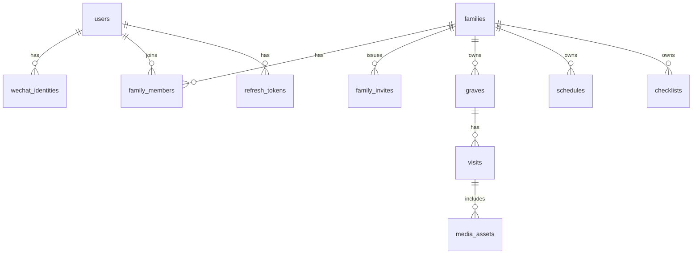

# 拜山啦 · 数据模型（小程序对齐）

| 项 | 内容 |
|---|---|
| 文档 | BAISHANLA-BE-MODEL-001 |
| 对应 | 产品方案核心对象；技术方案 §3.3；微信登录 / 家庭邀请设计 |
| 版本 | B/0 |
| 日期 | 2026-09-12 |
| 状态 | 设计稿 · 与小程序 storage mock 字段对齐 |
| DB | PostgreSQL 16；EF Core Code First |
| 非目标 | 聚家；农历引擎；端到端加密 |

---

## 1. 约定

- 主键：`uuid`，应用侧生成（或 DB `gen_random_uuid()`）
- 审计：业务表含 `created_at`、`updated_at`（timestamptz）
- 软删：`families` / `graves` / `visits` 用 `deleted_at`；成员用硬删或 `left_at`
- 坐标：**WGS84** 入库；小程序地图展示时再转国测局（若用腾讯/高德）
- API JSON：**camelCase**；库内 **snake_case**
- 家庭隔离：业务行必有 `family_id`（或经 grav → family 可解析并强制校验）

## 2. ER（逻辑）



## 3. Identity

### users

| 列 | 类型 | 说明 |
|---|---|---|
| id | uuid PK | |
| phone | varchar(20) null unique | 微信后补绑定 |
| email | varchar(256) null unique | 预留 |
| nickname | varchar(64) not null | |
| avatar_url | text null | |
| timezone | varchar(64) not null default `Asia/Shanghai` | |
| last_login_at | timestamptz null | |
| created_at / updated_at | timestamptz | |

### wechat_identities

| 列 | 类型 | 说明 |
|---|---|---|
| id | uuid PK | |
| user_id | uuid FK → users | |
| app_id | varchar(32) | |
| openid | varchar(64) | unique(app_id, openid) |
| unionid | varchar(64) null | unique partial |
| session_key_enc | bytea null | |
| session_key_updated_at | timestamptz null | |
| created_at / updated_at | timestamptz | |

### refresh_tokens

| 列 | 类型 | 说明 |
|---|---|---|
| id | uuid PK | |
| user_id | uuid | |
| token_hash | char(64) | |
| expires_at | timestamptz | |
| revoked_at | timestamptz null | |
| replaced_by | uuid null | 旋转链 |
| user_agent | varchar(256) null | 小程序可记平台版本 |
| created_at | timestamptz | |

## 4. Family

### families

| 列 | 类型 | 说明 |
|---|---|---|
| id | uuid PK | |
| name | varchar(64) | |
| theme | varchar(32) | 默认 `spring_qingming` |
| owner_user_id | uuid | 冗余便于查询；以 members.role=owner 为准可双写 |
| deleted_at | timestamptz null | |
| created_at / updated_at | | |

### family_members

| 列 | 类型 | 说明 |
|---|---|---|
| family_id | uuid | PK 联合 |
| user_id | uuid | PK 联合 |
| role | enum | `owner` / `editor` / `viewer` |
| joined_at | timestamptz | |

### family_invites

| 列 | 类型 | 说明 |
|---|---|---|
| id | uuid PK | |
| family_id | uuid | |
| token_hash | char(64) unique | |
| role | enum | 默认 editor |
| expires_at | timestamptz | |
| max_uses | int | 默认 10 |
| used_count | int | 默认 0 |
| created_by | uuid | |
| revoked_at | timestamptz null | |
| created_at | timestamptz | |

## 5. Grave / Visit / Media

### graves

| 列 | 类型 | 说明 |
|---|---|---|
| id | uuid PK | |
| family_id | uuid idx | |
| name | varchar(80) | |
| memorial_names | varchar(200) | |
| lat / lng | double precision null | WGS84 |
| address_text | varchar(256) null | |
| note | text null | |
| cover_media_id | uuid null | |
| created_by | uuid | |
| deleted_at | timestamptz null | |
| created_at / updated_at | | |

### visits

| 列 | 类型 | 说明 |
|---|---|---|
| id | uuid PK | |
| family_id | uuid | 鉴权冗余 |
| grave_id | uuid idx | |
| visited_on | date | 用户时区日历日 |
| title | varchar(80) null | |
| body | text null | |
| tags | jsonb | 如 `["晴","家人齐"]` |
| created_by | uuid | |
| deleted_at | timestamptz null | |
| created_at / updated_at | | |

索引：`(family_id, visited_on desc)`、`(grave_id, visited_on desc)`。

### media_assets

| 列 | 类型 | 说明 |
|---|---|---|
| id | uuid PK | |
| family_id | uuid | |
| visit_id | uuid null | complete 前可空 |
| kind | enum | `image` / `video` |
| storage_key | text | |
| url | text | CDN 或拼接 |
| thumb_url | text null | |
| mime | varchar(64) | |
| size_bytes | bigint | |
| width / height / duration_ms | int null | |
| status | enum | `pending` / `ready` / `failed` |
| created_by | uuid | |
| created_at / updated_at | | |

限制（MVP）：图 ≤ 10MB；视频 ≤ 100MB / ≤ 3min；单 Visit ≤ 9 图 + 1 视频。小程序侧优先压缩后上传。

## 6. Schedule / Checklist

### schedules

| 列 | 类型 | 说明 |
|---|---|---|
| id | uuid PK | |
| family_id | uuid | |
| grave_id | uuid null | 空=家庭级 |
| title | varchar(80) | |
| kind | enum | `qingming` / `chongyang` / `death_anniversary` / `custom` |
| rrule | varchar(128) null | MVP：`FREQ=YEARLY` 或空 |
| once_on | date null | |
| month / day | smallint null | 公历年历 |
| lunar_note | varchar(64) null | **只展示，不计算** |
| remind_days | int[] | 如 `{7,3,1}` |
| assignee_user_id | uuid null | |
| next_occurrence | date null | 物化；夜间任务刷新 |
| created_at / updated_at | | |

订阅消息（2027-01 段）：另表 `subscribe_receipts(user_id, template_id, granted_at)`；发送记录 `notify_outbox`。本模型阶段只保证 `openid` 可关联 user。

### checklists / checklist_items

**checklists**

| 列 | 说明 |
|---|---|
| id, family_id, grave_id null | |
| kind | `template` / `instance` |
| title | |
| source_template_id | 实例来源 |
| schedule_id / visit_id | 可选 |
| created_at / updated_at | |

**checklist_items**

| 列 | 说明 |
|---|---|
| id, checklist_id | |
| name, quantity, unit | |
| is_required | bool |
| sort_order | int |
| checked_at, checked_by | 勾选 |

## 7. 小程序 mock 对象形状（camelCase）

前端 storage mock 建议直接用下列 TypeScript 形状，接真 API 时零改名：

```ts
type Role = 'owner' | 'editor' | 'viewer'

interface User {
  id: string
  nickname: string
  avatarUrl: string | null
  phoneBound: boolean
  timezone: string
}

interface Family {
  id: string
  name: string
  theme: string
  role: Role
}

interface Grave {
  id: string
  familyId: string
  name: string
  memorialNames: string
  lat: number | null
  lng: number | null
  addressText: string | null
  note: string | null
  coverMediaId: string | null
}

interface Visit {
  id: string
  familyId: string
  graveId: string
  visitedOn: string // YYYY-MM-DD
  title: string | null
  body: string | null
  tags: string[]
  mediaIds: string[]
}

interface Schedule {
  id: string
  familyId: string
  graveId: string | null
  title: string
  kind: 'qingming' | 'chongyang' | 'death_anniversary' | 'custom'
  onceOn: string | null
  month: number | null
  day: number | null
  remindDays: number[]
  assigneeUserId: string | null
  nextOccurrence: string | null
}

interface ChecklistItem {
  id: string
  name: string
  quantity: number | null
  unit: string | null
  isRequired: boolean
  sortOrder: number
  checkedAt: string | null
  checkedBy: string | null
}

interface Checklist {
  id: string
  familyId: string
  graveId: string | null
  kind: 'template' | 'instance'
  title: string
  items: ChecklistItem[]
}
```

## 8. 模块落库优先级（11 月地基）

| 序 | 模块 | 表 |
|---|---|---|
| 1 | Identity | users, wechat_identities, refresh_tokens |
| 2 | Family | families, family_members, family_invites |
| 3 | Grave / Visit | graves, visits |
| 4 | Checklist | checklists, checklist_items |
| 5 | Schedule | schedules（提醒通道可后置） |
| 6 | Media | media_assets + 预签名（可与 Visit 并行） |

Home 聚合 `/home/summary`：读 schedules.next_occurrence + 最近 visits + checklist 进度，不单独立表。

## 9. 与旧技术方案差异摘要

| 点 | 旧稿 | 本对齐稿 |
|---|---|---|
| 主登录 | OTP | 微信 identity |
| 客户端形态 | H5/PWA | 小程序为主；H5 仅对照 |
| 邀请 | Web link | 小程序 path + token |
| 字段命名对外 | 未钉死 | **camelCase** 钉死给小程序 mock |
