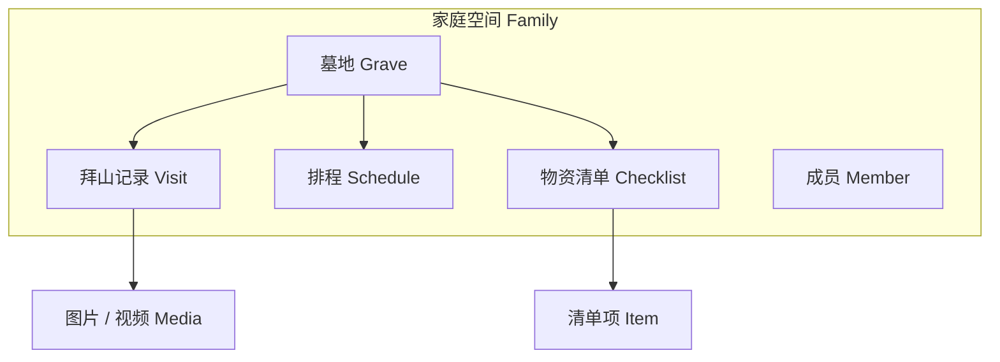

# 拜山啦 · 产品方案与页面结构

| 项 | 内容 |
|---|---|
| 产品名 | 拜山啦 |
| 形态 | 手机优先 H5 / PWA（可加到主屏） |
| 阶段 | MVP（第一期） |
| 日期 | 2026-09-12 |
| 状态 | 草案，待评审 |

---

## 1. 产品一句话

帮一家人把「去哪拜、何时拜、带什么、谁来记」收在一个清爽的清明春意空间里。

## 2. 设计原则

1. **轻、净、暖**：浅青绿 + 米白 + 淡樱粉点缀；留白多，字轻，不走沉重祭奠风。
2. **先记后管**：定位和记录是刚需；排程、清单、协作是围绕记录转的。
3. **家庭空间优先**：所有墓地、记录、清单默认属于一个「家庭空间」，成员按角色协作。
4. **手机单手可用**：底部导航 ≤ 4；主操作大按钮；地图与相册走系统能力。
5. **MVP 砍干净**：不做公墓商城、不做复杂族谱、不做社交动态广场。

## 3. 用户与角色

| 角色 | 能力 |
|---|---|
| 所有者 Owner | 建家庭、删墓地、管理成员、移交所有权 |
| 编辑 Editor | 增改墓地/记录/排程/清单，上传媒体 |
| 查看 Viewer | 只读墓地、记录、排程、清单 |

第一期邀请方式：链接邀请 → 登录后加入家庭。一人可属于多个家庭（父母两边），首页可切换当前家庭。

## 4. 信息架构



核心对象：

| 对象 | 关键字段 |
|---|---|
| Family | 名称、封面色/节气主题 |
| Member | 用户、角色、加入时间 |
| Grave | 名称、纪念对象、经纬度、地址文案、备注、封面图 |
| Visit | 所属墓地、日期、标题、正文、天气/心情标签（可选）、媒体列表 |
| Schedule | 所属墓地或家庭级、类型（清明/重阳/忌日/自定义）、规则（每年/一次）、提前提醒天数、负责人 |
| Checklist | 模板或某次拜山实例、所属墓地、标题 |
| ChecklistItem | 名称、数量、单位、是否必备、勾选状态与勾选人 |
| Media | 类型、URL、缩略图、上传者、关联 Visit |

## 5. 导航与页面地图

### 5.1 底部 Tab（登录后）

| Tab | 名称 | 职责 |
|---|---|---|
| 1 | 首页 | 下一场排程、快捷记一笔、家庭概览 |
| 2 | 墓地 | 墓地列表与档案 |
| 3 | 记录 | 按时间线的拜山记录 |
| 4 | 我的 | 家庭切换、成员、设置 |

排程与物资不单独占 Tab：从首页卡片、墓地详情进入。

### 5.2 页面清单

#### A. 账户

| 页面 | 说明 |
|---|---|
| A1 欢迎页 | 品牌名、一句 slogan、清明插画、登录/注册 |
| A2 登录 | 手机号验证码 **或** 邮箱魔法链接（MVP 二选一落地，另一项可后补） |
| A3 完善资料 | 昵称、头像 |

#### B. 家庭

| 页面 | 说明 |
|---|---|
| B1 创建 / 加入家庭 | 新建家庭名；或粘贴邀请码/打开邀请链接 |
| B2 家庭切换 | 多家庭时从「我的」进入 |
| B3 成员与邀请 | 列表、角色、生成邀请链接、移除成员 |

#### C. 首页

| 页面 | 说明 |
|---|---|
| C1 首页 | ① 下一场拜山（日期、墓地、负责人）② 一键「记一次拜山」③ 待办物资进度 ④ 最近记录 3 条 |

#### D. 墓地

| 页面 | 说明 |
|---|---|
| D1 墓地列表 | 卡片：封面、名称、纪念对象、距下次拜山 |
| D2 新建 / 编辑墓地 | 名称、纪念对象、地图选点、地址、备注、封面 |
| D3 墓地详情 | 定位入口、备注、近期记录、绑定排程、物资模板、编辑入口 |
| D4 地图定位 | 选点、搜索地址、保存经纬度；支持「导航到这里」（唤起系统地图） |

#### E. 记录

| 页面 | 说明 |
|---|---|
| E1 记录时间线 | 全家或按墓地筛选；按年分组 |
| E2 新建 / 编辑记录 | 选墓地、日期、文字、传图/视频、可选标签 |
| E3 记录详情 | 全文、媒体浏览、编辑/删除（按角色） |

#### F. 排程

| 页面 | 说明 |
|---|---|
| F1 排程列表 | 从首页「全部排程」或墓地详情进入 |
| F2 新建 / 编辑排程 | 类型、日期规则、提醒、负责人、关联墓地 |
| F3 提醒落地 | MVP：应用内待办 + 日历订阅文件（.ics）可选；系统推送放二期 |

#### G. 物资

| 页面 | 说明 |
|---|---|
| G1 清单模板 | 按墓地的常用物资 |
| G2 本次清单 | 从某次排程/记录生成，可勾选；显示谁勾的 |
| G3 编辑清单项 | 增删改名称、数量 |

#### H. 我的

| 页面 | 说明 |
|---|---|
| H1 我的 | 当前家庭、成员入口、通知偏好、关于、退出 |

## 6. 关键用户流程

### 6.1 首次使用

欢迎 → 登录 → 创建家庭 → 添加第一座墓地（含定位）→ 回到首页。

### 6.2 记一次拜山

首页「记一次」→ 选墓地（默认上次）→ 填日期与文字 → 传媒体 → 可选「同步勾掉本次清单」→ 保存 → 时间线可见。

### 6.3 清明协作

Owner 建排程（清明，提前 7/3/1 天）→ 从模板生成本次清单 → 邀请链接拉家人 → 家人勾物资、到场后谁都可以补记录与照片。

### 6.4 找墓地

墓地详情 → 打开地图 / 一键导航（系统地图 App）。

## 7. 页面线框优先级（MVP 必做）

P0（第一期必须可点）：

- A1 / A2、B1、B3  
- C1、D1–D4、E1–E3  
- F1–F2、G1–G2、H1  

P1（紧随其后）：

- 多家庭切换 B2  
- 清单模板复用到「本次」  
- .ics 导出  
- 记录按墓地筛选  

P2（明确不做进 MVP）：

- 原生推送、微信支付、公墓黄页、族谱树、AI 祭文、视频直播、微信小程序包

## 8. 视觉与文案语气

| 令牌 | 建议 |
|---|---|
| 主色 | 浅青绿 `#7BAF9E` |
| 背景 | 米白 `#F7F3EA` |
| 强调 | 淡樱粉 `#E7B8B0` |
| 文字 | 墨灰 `#2F3A36`，次级更浅 |
| 圆角 | 大圆角卡片，12–20px |
| 插画 | 细线春山、新芽、纸鸢，忌香灰、重黑 |
| 文案 | 「去看一看」「记一笔」「带上这些」——口语、轻、不煽情 |

PWA：主题色用主色；图标用新芽/小山剪影，名称「拜山啦」。

## 9. 技术骨架（方案级，非实现细设）

| 层 | 建议 |
|---|---|
| 前端 | React / Vite，移动端优先，PWA（manifest + service worker 缓存壳） |
| 样式 | Tailwind；组件少而清 |
| 后端 | Node 或 .NET Minimal API（按你习惯二选一） |
| 数据 | PostgreSQL |
| 媒体 | 对象存储（图压缩；视频直传 + 时长/大小上限） |
| 地图 | 高德 / 腾讯地图（选点 + 展示）；导航跳转系统地图 |
| 鉴权 | JWT；邀请链接带一次性 token |
| 提醒 | MVP 站内「即将到来」；二期再上 Push |

### 9.1 API 分组（草案）

```
POST   /auth/login
GET    /me
POST   /families
POST   /families/join
GET    /families/:id/members
POST   /families/:id/invites

GET|POST        /graves
GET|PATCH|DEL   /graves/:id

GET|POST        /visits
GET|PATCH|DEL   /visits/:id
POST            /visits/:id/media

GET|POST        /schedules
PATCH|DEL       /schedules/:id

GET|POST        /checklists
POST            /checklists/:id/items
PATCH           /checklist-items/:id   # 勾选
```

## 10. 验收标准（MVP）

1. 两人用邀请链接进入同一家庭，能看到同一座墓地。  
2. 能保存定位并唤起系统导航。  
3. 能发一条带图的拜山记录，时间线按年可见。  
4. 能建清明排程，首页露出「下一场」。  
5. 能从模板生成清单并多人勾选。  
6. 加到手机主屏后，离线至少能打开壳子与最近缓存列表（媒体可降级）。  
7. 整体观感：浅、净、春意，不压抑。

## 11. 建议下一步

1. 你拍板本草案（尤其：登录用手机号还是邮箱；地图用高德还是腾讯）。  
2. 出 6–8 张关键页高保真（欢迎、首页、墓地详情、记一笔、清单、成员）。  
3. 再建仓库开工（前端 PWA + 后端 API）。

---

*拜山啦 · 产品方案 A/0 · 2026-09-12*
