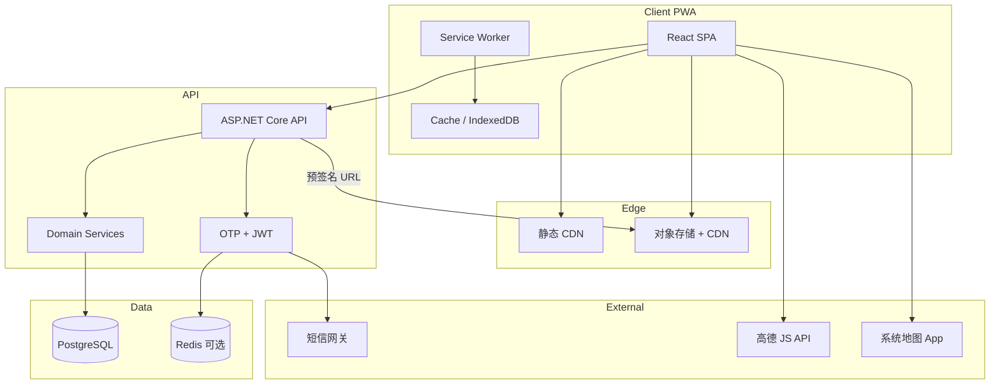
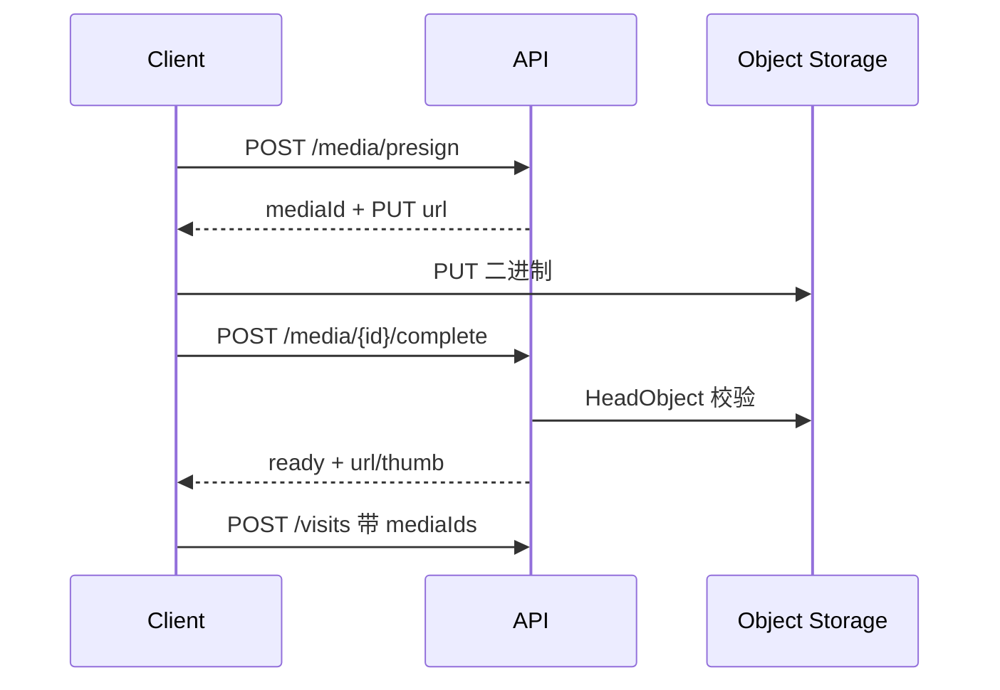
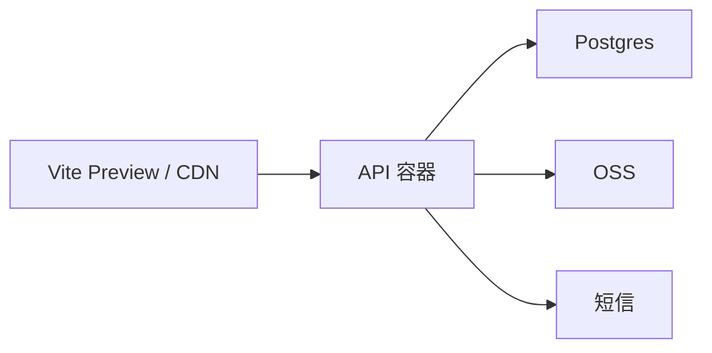

# 拜山啦 · 详细技术方案（审核稿）

| 项 | 内容 |
|---|---|
| 文档编号 | BAISHANLA-TECH-001 |
| 对应产品 | [产品方案-页面结构.md](./产品方案-页面结构.md) |
| 版本 | A/0 |
| 日期 | 2026-09-12 |
| 状态 | **待审核** |
| 范围 | 前端 · 后端 · UX · UI · 部署与非功能 |

---

## 0. 审核用默认假设（可改）

产品方案里两项未拍板，本技术方案先按下列默认写死，便于评审；你改一项即可全局替换。

| 决策点 | 默认 | 备选 | 影响面 |
|---|---|---|---|
| 登录 | **手机号 + 短信验证码** | 邮箱魔法链接 | 鉴权、第三方费用、注册转化 |
| 地图 | **高德 JS API 2.0**（Web） | 腾讯位置服务 | 选点页、密钥、合规 |
| 后端 | **ASP.NET Core 9 Minimal API + EF Core** | NestJS / Next Route Handlers | 仓库结构、部署镜像 |
| 前端 | **React 19 + Vite + TS + Tailwind** | Next.js App Router | SSR 需求（MVP 不需要） |
| 对象存储 | **S3 兼容**（本地 MinIO / 生产阿里云 OSS） | 腾讯云 COS | 上传签名、CDN |
| 短信 | 阿里云短信 | 腾讯云短信 | OTP 发送 |
| 时区 | 用户资料存 `Asia/Shanghai`，排程按该时区算「下一次」 | — | Schedule 计算 |

> 选用 .NET 后端的理由：与你现有技术栈一致，长期可自维；H5 不需要 SSR。若你希望一人全 TS 更快出 MVP，可改成 Nest，接口契约不变。

---

## 1. 目标与非目标

### 1.1 目标（MVP）

1. 家庭空间内：墓地定位、拜山记录（图/视频）、排程、物资清单、成员协作。
2. 手机优先 H5，可「添加到主屏」的 PWA（离线壳 + 列表缓存）。
3. 清爽清明春意 UI，单手可操作。
4. 接口、权限、媒体上传可审计、可扩展到多家庭。

### 1.2 非目标（MVP 明确不做）

- 微信小程序包、原生 App 壳、APNs/FCM 推送
- 支付、商城、公墓黄页、族谱树、AI 祭文
- 端到端加密、国密、多地多活
- 复杂工作流引擎、审批流

---

## 2. 总体架构



### 2.1 仓库建议（Monorepo）

```
baishanla/
  apps/
    web/                 # Vite React PWA
    api/                 # ASP.NET Core
  packages/
    api-contract/        # OpenAPI 生成的 TS 类型（可选）
  docs/
    产品方案-页面结构.md
    技术方案.md
  docker-compose.yml     # api + postgres + minio (+ redis)
```

### 2.2 环境

| 环境 | 用途 |
|---|---|
| local | docker-compose：Postgres、MinIO、API、Vite dev |
| staging | 完整链路，真实短信可切「日志验证码」开关 |
| production | API + PG + OSS + CDN；HTTPS 强制 |

---

## 3. 后端技术方案

### 3.1 技术选型

| 层 | 选型 | 说明 |
|---|---|---|
| 运行时 | .NET 9 | LTS 邻近；Minimal API |
| ORM | EF Core 9 | Code First + Migration |
| DB | PostgreSQL 16 | JSONB 备用；主表关系型 |
| 鉴权 | JWT（Access 15m + Refresh 30d） | Refresh 旋转；家庭切换不换用户 |
| 校验 | FluentValidation | |
| 文档 | Swagger / OpenAPI 3 | 前端可生成 client |
| 日志 | Serilog → Console/文件 | 请求 Id 贯通 |
| 健康检查 | `/health` | DB、存储探活 |

Redis：**MVP 可选**。OTP 与刷新令牌黑名单可先落 Postgres；日活起来再上 Redis。

### 3.2 限界上下文（模块）

| 模块 | 职责 |
|---|---|
| Identity | 用户、OTP、JWT、会话 |
| Family | 家庭、成员、邀请、角色 |
| Grave | 墓地档案、坐标 |
| Visit | 拜山记录、媒体元数据 |
| Schedule | 排程、下次发生时间计算 |
| Checklist | 模板清单、实例清单、勾选 |
| Media | 预签名上传、回调确认、删除 |
| Home | 聚合「下一场 / 最近记录 / 清单进度」 |

模块间只通过 Application Service 调用，禁止跨模块直接碰 DbSet（审核时可放宽为单 DbContext + 文件夹分区，MVP 够用）。

### 3.3 数据模型（逻辑表）

> 所有业务表含：`id` UUID、`created_at`、`updated_at`；软删用 `deleted_at`（墓地/记录/家庭）。

#### users
| 列 | 类型 | 说明 |
|---|---|---|
| id | uuid PK | |
| phone | varchar(20) unique null | 默认登录键 |
| email | varchar(256) unique null | 预留 |
| nickname | varchar(64) | |
| avatar_url | text null | |
| timezone | varchar(64) | 默认 Asia/Shanghai |
| last_login_at | timestamptz | |

#### otp_challenges
| 列 | 类型 | 说明 |
|---|---|---|
| id | uuid | |
| phone | varchar(20) | |
| code_hash | char(64) | 只存哈希 |
| expires_at | timestamptz | 5 分钟 |
| consumed_at | timestamptz null | |
| attempt_count | int | 上限 5 |
| ip | inet | 风控 |

#### families
| 列 | 类型 | 说明 |
|---|---|---|
| id | uuid | |
| name | varchar(64) | |
| theme | varchar(32) | 如 spring_qingming |
| owner_user_id | uuid | |

#### family_members
| 列 | 类型 | 说明 |
|---|---|---|
| family_id | uuid | PK 联合 |
| user_id | uuid | PK 联合 |
| role | enum | owner / editor / viewer |
| joined_at | timestamptz | |

唯一约束：`(family_id, user_id)`。同一用户多家庭多行。

#### family_invites
| 列 | 类型 | 说明 |
|---|---|---|
| id | uuid | |
| family_id | uuid | |
| token_hash | char(64) | URL 只带明文 token 一次 |
| role | enum | 默认 editor |
| expires_at | timestamptz | 7 天 |
| max_uses | int | MVP=20 或 1（审核二选一，默认 **10**） |
| used_count | int | |
| created_by | uuid | |
| revoked_at | timestamptz null | |

#### graves
| 列 | 类型 | 说明 |
|---|---|---|
| id | uuid | |
| family_id | uuid idx | |
| name | varchar(80) | |
| memorial_names | varchar(200) | 纪念对象，逗号或原文 |
| lat | double precision null | WGS84；展示时转国测局若用地图 SDK |
| lng | double precision null | |
| address_text | varchar(256) null | |
| note | text null | |
| cover_media_id | uuid null | |
| created_by | uuid | |

坐标约定：**库内统一存 WGS84**；前端高德展示用 SDK 转换，避免混用 GCJ-02 入库。

#### visits
| 列 | 类型 | 说明 |
|---|---|---|
| id | uuid | |
| family_id | uuid | 冗余便于鉴权 |
| grave_id | uuid idx | |
| visited_on | date | 拜山日期（用户时区日历日） |
| title | varchar(80) null | |
| body | text null | |
| tags | jsonb | `["晴","家人齐"]` 可选 |
| created_by | uuid | |

索引：`(family_id, visited_on desc)`、`(grave_id, visited_on desc)`。

#### media_assets
| 列 | 类型 | 说明 |
|---|---|---|
| id | uuid | |
| family_id | uuid | |
| visit_id | uuid null | 确认前可空 |
| kind | enum | image / video |
| storage_key | text | |
| url | text | CDN URL（或拼出来） |
| thumb_url | text null | |
| mime | varchar(64) | |
| size_bytes | bigint | |
| width / height / duration_ms | int null | |
| status | enum | pending / ready / failed |
| created_by | uuid | |

限制（MVP）：图片 ≤ 10MB，视频 ≤ 100MB / ≤ 3 分钟；单条 Visit ≤ 9 图 + 1 视频。

#### schedules
| 列 | 类型 | 说明 |
|---|---|---|
| id | uuid | |
| family_id | uuid | |
| grave_id | uuid null | 空=家庭级 |
| title | varchar(80) | |
| kind | enum | qingming / chongyang / death_anniversary / custom |
| rrule | varchar(128) null | 简化：MVP 只用 `FREQ=YEARLY` 或 空（一次） |
| once_on | date null | 一次性 |
| month | smallint null | 年历：忌日用公历月日 |
| day | smallint null | |
| lunar_note | varchar(64) null | **MVP 只展示备注，不计算农历**（二期） |
| remind_days | int[] | 如 `{7,3,1}` |
| assignee_user_id | uuid null | |
| next_occurrence | date null | 物化字段，夜间任务刷新 |

清明/重阳：MVP 用**内置公历近似表或固定规则配置表**（按年可调），不引入完整农历库；文档标注「节气日期每年可运营更新」。

#### checklists / checklist_items
| checklists | 说明 |
|---|---|
| id, family_id, grave_id null | |
| kind | `template` / `instance` |
| title | |
| source_template_id | 实例来自哪份模板 |
| schedule_id / visit_id | 可选关联 |

| checklist_items | 说明 |
|---|---|
| id, checklist_id | |
| name, quantity, unit | |
| is_required | bool |
| sort_order | int |
| checked_at, checked_by | 勾选 |

### 3.4 权限模型

每个写接口：`RequireFamilyRole(familyId, minRole)`。

| 动作 | Owner | Editor | Viewer |
|---|---|---|---|
| 读家庭内资源 | ✓ | ✓ | ✓ |
| 增改墓地/记录/排程/清单 | ✓ | ✓ | ✗ |
| 上传媒体 | ✓ | ✓ | ✗ |
| 勾选清单项 | ✓ | ✓ | ✗（审核可放开 Viewer 勾选，默认 **Editor+**） |
| 邀请/改角色/移除 | ✓ | ✗ | ✗ |
| 删家庭/移交接 | ✓ | ✗ | ✗ |
| 删墓地/删记录 | ✓ | ✓ | ✗ |

**家庭隔离**：所有查询强制 `family_id = 当前上下文`。当前家庭由请求头传递：

```
Authorization: Bearer <access>
X-Family-Id: <uuid>
```

无头时：若用户仅一家庭则默认；多家庭返回 `409 FAMILY_REQUIRED`。

### 3.5 API 设计

前缀：`/api/v1`。统一响应：

```json
{
  "ok": true,
  "data": {},
  "error": null,
  "requestId": "..."
}
```

错误码示例：`UNAUTHORIZED` `FORBIDDEN` `FAMILY_REQUIRED` `OTP_INVALID` `INVITE_EXPIRED` `VALIDATION` `NOT_FOUND` `CONFLICT` `PAYLOAD_TOO_LARGE`。

#### Identity
| Method | Path | 说明 |
|---|---|---|
| POST | `/auth/otp/send` | `{ phone }` 限流：同号 60s 1 次，同 IP 小时级上限 |
| POST | `/auth/otp/verify` | 返回 access + refresh + user |
| POST | `/auth/refresh` | 旋转 refresh |
| POST | `/auth/logout` | 作废 refresh |
| GET | `/me` | |
| PATCH | `/me` | nickname, avatar, timezone |

#### Family
| Method | Path | 说明 |
|---|---|---|
| GET | `/families` | 我加入的 |
| POST | `/families` | 创建并成为 owner |
| GET | `/families/{id}` | |
| PATCH | `/families/{id}` | |
| GET | `/families/{id}/members` | |
| PATCH | `/families/{id}/members/{userId}` | 改角色 |
| DELETE | `/families/{id}/members/{userId}` | |
| POST | `/families/{id}/invites` | 返回 `https://app.../join?token=` |
| POST | `/families/join` | `{ token }` |

#### Graves / Visits / Schedules / Checklists
与产品方案 9.1 一致，补充：

| Method | Path | 说明 |
|---|---|---|
| GET | `/home/summary` | 下一场排程、待办清单进度、最近 3 条记录 |
| POST | `/media/presign` | `{ kind, mime, size }` → `{ uploadUrl, mediaId, headers }` |
| POST | `/media/{id}/complete` | 客户端上传成功后确认；服务端可头探测 |
| GET | `/visits` | `?graveId&year&cursor` |
| POST | `/checklists/{id}/clone` | 模板 → 本次实例 |

分页：cursor（`created_at + id`），pageSize 默认 20。

### 3.6 媒体上传流



图片：complete 时可异步生成缩略图（MVP 可同步小图或前端压缩后上传，**默认前端压缩到长边 1920** 再传，降低服务器压力）。

视频：MVP **不做转码**；仅校验大小/时长（若取不到时长则只校验大小）。

### 3.7 排程与提醒

- 写入/每日 00:10 任务：重算 `next_occurrence`。
- MVP 提醒通道：**首页「即将到来」+ 可选导出 `.ics`**（`GET /schedules/{id}/ics`）。
- 不做邮件/短信提醒轰炸（短信只用于登录）。

### 3.8 安全

| 项 | 做法 |
|---|---|
| HTTPS | 全站强制 |
| JWT | 短 access；refresh HttpOnly 也可，但纯 SPA 默认 **双 token 存内存 + refresh 存 localStorage**（注明 XSS 风险，CSP 收紧） |
| OTP | 哈希存储、次数限制、冷却 |
| 邀请 | 高熵 token、哈希入库、过期与撤销 |
| 上传 | 预签名短时（10min）、Content-Type 白名单、大小校验 |
| IDOR | 一切资源校验 family membership |
| 日志 | phone 脱敏；不落验证码明文 |
| CORS | 仅允许 Web Origin |
| 率限 | IP + phone 维度 |

隐私：墓地坐标属敏感位置信息——仅家庭成员可见；导出/分享 MVP 不做公开链接。

---

## 4. 前端技术方案

### 4.1 技术选型

| 项 | 选型 |
|---|---|
| 框架 | React 19 + TypeScript |
| 构建 | Vite 6 |
| 路由 | React Router 7 |
| 样式 | Tailwind CSS 4 |
| 组件 | 自研基础组件（Button/Input/Sheet/Tabs），不引入重型 UI 库 |
| 状态 | Zustand（session、currentFamily）；服务端状态 TanStack Query |
| 表单 | React Hook Form + Zod |
| 地图 | `@amap/amap-jsapi-loader` |
| PWA | `vite-plugin-pwa`（Workbox） |
| 日期 | dayjs + 时区插件 |
| 图标 | lucide-react（细线） |
| 质检 | ESLint、Prettier、Vitest（关键工具函数） |

### 4.2 目录结构

```
apps/web/src/
  app/                 # Router、providers、布局
  pages/               # 按路由页
  features/
    auth/
    family/
    grave/
    visit/
    schedule/
    checklist/
    home/
  components/ui/       # 设计系统 primitive
  components/pattern/  # GraveCard、VisitCard、ScheduleBanner…
  lib/                 # api client、auth、geo、compress
  styles/              # tokens.css
  sw/                  # 可选自定义缓存策略
```

### 4.3 路由表

| 路径 | 页面 | 鉴权 |
|---|---|---|
| `/welcome` | 欢迎 | 否 |
| `/login` | 登录 | 否 |
| `/join` | 接受邀请 | 登录后 |
| `/` | 首页 C1 | 是 |
| `/graves` | 列表 D1 | 是 |
| `/graves/new` | 新建 D2 | Editor+ |
| `/graves/:id` | 详情 D3 | 是 |
| `/graves/:id/edit` | 编辑 | Editor+ |
| `/graves/:id/map` | 定位 D4 | Editor+ 写 / 全员读导航 |
| `/visits` | 时间线 E1 | 是 |
| `/visits/new` | 记一笔 E2 | Editor+ |
| `/visits/:id` | 详情 E3 | 是 |
| `/schedules` | 列表 F1 | 是 |
| `/schedules/new` | 新建 F2 | Editor+ |
| `/checklists/:id` | 清单 G2 | 是 |
| `/me` | 我的 H1 | 是 |
| `/me/family` | 成员 B3 | 是 |
| `/me/families` | 切换 B2 | 是 |

未登录访问受保护路由 → `/login?next=`。

### 4.4 状态与数据获取

- `useSessionStore`：user、tokens、hydrate
- `useFamilyStore`：currentFamilyId（持久化 localStorage）
- Query keys：`['home', familyId]`、`['graves', familyId]`、`['visits', familyId, filters]`…
- 变更后精确失效；乐观更新仅用于清单勾选。

### 4.5 PWA 策略

| 资源 | 策略 |
|---|---|
| App Shell（JS/CSS/字体） | Precache |
| API GET 列表 | NetworkFirst，超时回缓存 |
| 媒体 | CacheFirst，容量上限，LRU 淘汰 |
| 写操作 | 仅在线；离线 Toast「连网后同步」 |

Manifest：`name=拜山啦`，`display=standalone`，`theme_color=#7BAF9E`，`background_color=#F7F3EA`，icons 192/512。

### 4.6 地图与导航

1. 选点页：高德地图 + 逆地理；确认后把 **WGS84** 交给 API（SDK 转回）。
2. 「导航到这里」：`https://uri.amap.com/...` / Apple Maps / geo: 渐进增强；优先唤起系统地图。
3. 无定位权限：允许只填地址文案，坐标可空。

### 4.7 媒体选择

- `input capture` + 相册；图片用 browser-image-compression。
- 上传进度条；失败可重试单张。
- 视频：`<video>` 播放；列表用缩略图（首帧或占位插画）。

### 4.8 可访问与适配

- 最小点击区 44×44。
- 安全区：`env(safe-area-inset-*)`。
- 目标宽度 375–430；最大内容宽 480 居中。
- 尊重 `prefers-reduced-motion`。
- 语义化按钮与表单 label；对比度正文 ≥ 4.5:1。

---

## 5. UX 方案

### 5.1 UX 原则

1. **3 步内完成主任务**：记一笔、勾清单、看下一场。
2. **少决策**：默认墓地=上次；默认日期=今天；清单从模板一键生成。
3. **协作可见**：勾选人、记录作者头像昵称始终露出。
4. **错误可恢复**：上传失败保留草稿（localStorage）；邀请过期给「请 Owner 重发」。
5. **情绪正确**：文案轻、不说教、不血腥意象；空状态用春山插画而非坟墓剪影。

### 5.2 关键任务流程（详）

#### 首次使用（幸福路径）

1. 欢迎页 → 手机登录  
2. 强制「创建家庭」或「我有邀请」二选一  
3. 创建后引导 Checklist：添加第一座墓地（可跳过定位）  
4. 进入首页，展示空状态 CTA  

#### 记一次拜山

1. 首页主按钮「记一笔」  
2. Sheet：选墓地（默认上次）  
3. 日期、文字、媒体  
4. 可选开关「打开本次物资清单」→ 有模板则 clone  
5. 发布 → Toast → 进详情或回时间线  

#### 清明协作

1. Owner 建排程（清明，提醒 7/3/1）  
2. 从墓地模板生成「2026 清明清单」  
3. 邀请家人；成员勾选  
4. 当日/事后任何人补记录与照片  

#### 找墓地

详情 →「导航」→ 系统地图；无坐标则展示地址文案 + 复制。

### 5.3 空状态与错误

| 场景 | UX |
|---|---|
| 无墓地 | 插画 +「先记下第一座山」 |
| 无记录 | 「春来记一笔」 |
| 无排程 | 「把清明安到日历上」 |
| 网络失败 | 顶部横幅，保留已填表单 |
| 无权限 | 说明角色，引导找 Owner |
| OTP 失败 | 明确剩余次数，防泄露是否注册 |

### 5.4 权限在界面上的表达

- Viewer：隐藏「新建」FAB；列表可进详情；编辑入口隐藏。  
- 危险操作（删除墓地）：二次确认底栏 Sheet，需输入墓地名。  

### 5.5 文案语气（示例）

| 场景 | 文案 |
|---|---|
| 主按钮 | 记一笔 |
| 排程空 | 把下次看望放进日历 |
| 清单 | 带上这些 |
| 导航 | 去这里 |
| 删除 | 删除后，记录还会在时间线吗？→ 说明级联策略 |

**级联策略（需你审核）**：删除墓地 → **软删墓地**，记录保留但标「原墓地已归档」；或禁止有记录时删除。**默认：有记录则禁止硬删，仅允许归档（软删，详情只读）。**

---

## 6. UI 方案

### 6.1 设计令牌

```css
:root {
  --color-bg: #F7F3EA;
  --color-surface: #FFFFFF;
  --color-surface-muted: #F0EBE0;
  --color-primary: #7BAF9E;
  --color-primary-pressed: #6A9E8D;
  --color-accent: #E7B8B0;
  --color-text: #2F3A36;
  --color-text-secondary: #6B776F;
  --color-text-inverse: #FFFFFF;
  --color-border: #E5E0D4;
  --color-danger: #C45C5C;
  --color-success: #5F8F7A;

  --radius-sm: 10px;
  --radius-md: 16px;
  --radius-lg: 22px;
  --radius-pill: 999px;

  --shadow-card: 0 8px 24px rgba(47, 58, 54, 0.06);
  --font-sans: "PingFang SC", "Noto Sans SC", system-ui, sans-serif;
  --space-1: 4px; /* … 到 32px 阶梯 */
}
```

暗色模式：**MVP 不做**。

### 6.2 字体与层级

| 级别 | 大小 / 字重 | 用途 |
|---|---|---|
| Display | 28 / 600 | 欢迎标题 |
| Title | 20 / 600 | 页标题 |
| Body | 16 / 400 | 正文 |
| Secondary | 14 / 400 | 辅助 |
| Caption | 12 / 400 | 时间、作者 |

行高 1.5；段落间距宽松。

### 6.3 组件清单（UI Kit）

| 组件 | 规格 |
|---|---|
| Button Primary | 高 48，圆角 pill，主色底，白字 |
| Button Secondary | 描边主色或浅底 |
| Button Ghost | 文字按钮 |
| TextField | 高 48，米白底，聚焦主色环 |
| TextArea | 最小 96 |
| Card | 白底，radius-md，轻阴影 |
| ListRow | 左标题右箭头，分割线浅 |
| BottomTab | 4 项，选中主色，未选次级灰 |
| FAB / 主 CTA | 首页大按钮「记一笔」 |
| Sheet | 圆角顶，拖拽条，用于确认/选择墓地 |
| Avatar | 24/32/40，粉绿双色占位 |
| Tag | 浅主色底 |
| EmptyState | 插画 + 标题 + CTA |
| Toast | 顶/底安全区 |
| Skeleton | 脉冲浅灰 |

### 6.4 关键页视觉结构

#### 欢迎 A1
- 上半：春山细线插画（浅青绿）  
- 中：Logo 字标「拜山啦」+ slogan「把看望，轻轻记下来」  
- 下：主按钮「开始」  

#### 首页 C1
1. 顶栏：家庭名切换 ▾  
2. Hero 卡：下一场排程（日期、墓地、负责人）  
3. 主按钮：记一笔  
4. 物资进度条（若有进行中清单）  
5. 最近记录 3 条横向/纵向卡片  

#### 墓地详情 D3
- 封面图或春山占位  
- 名称、纪念对象  
- 操作条：导航 | 记一笔 | 清单 | 更多  
- 分段：备注、近期记录、排程  

#### 记一笔 E2
- 单页表单 + 底部固定「发布」  
- 媒体区 3×3 宫格加号  

#### 清单 G2
- 项左侧大勾选圆  
- 右侧数量  
- 勾选后显示「谁 · 时间」caption  

### 6.5 动效

- 页面切换：150–200ms fade + 微位移  
- 勾选：弹性 200ms  
- 禁用长抛物线动画  

### 6.6 插画与品牌

- 统一线性插画集：新芽、远山、纸鸢、春雨（抽象）  
- **禁止**：写实墓碑、香灰、哭丧元素  
- App Icon：远山 + 新芽剪影，主色底或米白底  

### 6.7 高保真交付物（本阶段文档后）

审核通过后出：

1. Figma（或等价）页面：A1、C1、D1、D3、E2、G2、B3、H1  
2. UI Kit 一页  
3. 切图/SVG 插画  

本技术方案 **A/0 不附 Figma 文件**，以令牌 + 线框级结构为准。

---

## 7. 跨端体验与设备能力

| 能力 | 策略 |
|---|---|
| 相机/相册 | 标准 input；iOS 注意 HTTPS |
| 地理定位 | 选点页请求；拒绝则手动搜地址 |
| 分享邀请 | Web Share API，失败则复制链接 |
| 震动 | 勾选成功可选轻震动 |
| 安装 PWA | 首页 Banner「加到主屏」指引（iOS 手动分享） |

---

## 8. 质量保障

| 类型 | MVP 范围 |
|---|---|
| API | 集成测试：OTP（测试双倍号）、家庭隔离、邀请、勾选并发 |
| Web | 组件烟测 + 关键流 Playwright（登录 → 建墓地 → 记一笔） |
| 契约 | OpenAPI 快照 |
| 性能 | 首屏 JS &lt; 300KB gzip 目标；LCP &lt; 2.5s（4G） |
| 安全 | 基础 OWASP 清单；依赖扫描 |

并发勾选：`PATCH item` 用更新 `checked_at` 最后写入胜出；UI Query 失效刷新。

---

## 9. 部署与运维



- API：Docker，单实例起步；配置用环境变量。  
- DB：托管 Postgres；每日备份。  
- 前端：静态托管（Cloudflare / 阿里云 OSS+CDN）。  
- 密钥：短信、地图、JWT、OSS 仅服务端；地图安全密钥走域名白名单 + 可选代理。  
- 观测：请求日志 + 错误率；MVP 不做完整 APM。

### 9.1 配置项（摘）

```
ConnectionStrings__Database
Jwt__SigningKey
Sms__Provider / Sms__SignName / Sms__TemplateCode
Oss__Endpoint / Oss__Bucket / Oss__AccessKey
Map__WebKey（若服务端代理）
PublicWebOrigin
Feature__OtpCodeInLogs = true  # 仅 staging
```

---

## 10. 里程碑与工作分解（供排期）

| 阶段 | 产出 | 预估（量级） |
|---|---|---|
| M0 审核 | 本文档 + 产品方案签字 | — |
| M1 地基 | Monorepo、CI、Docker、鉴权、家庭、邀请 | 1 周 |
| M2 核心 | 墓地+地图、记录+上传、首页聚合 | 1.5 周 |
| M3 协作 | 排程、清单模板/实例、成员管理 | 1 周 |
| M4 体验 | PWA、空状态插画、.ics、打磨 UI | 0.5–1 周 |
| M5 验收 | Playwright 主路径、staging 试用 | 0.5 周 |

人员假设：全栈 1～2 人。你审核后我可按模块拆任务卡。

---

## 11. 风险与对策

| 风险 | 对策 |
|---|---|
| 短信成本与盗刷 | 严格限流；staging 固定码；生产验证码 |
| 农历/清明日期不准 | MVP 配置表；文案写「可调整」 |
| iOS PWA 能力弱 | 不依赖角标推送；引导手动添加 |
| 坐标系混乱 | 库内 WGS84；文档+单测锁定 |
| 视频存储贵 | 时长/大小硬限制；提醒压缩 |
| 家庭误删 | 软删+Owner 二次确认 |

---

## 12. 请你重点审核的清单

请对下列项给出「同意 / 修改意见」：

1. **登录**：手机号 OTP（默认）是否 OK？  
2. **地图**：高德是否 OK？  
3. **后端**：ASP.NET Core 是否 OK？（或改全 TS）  
4. **Viewer 能否勾选清单**？默认不能。  
5. **删除墓地策略**：有记录则仅归档。  
6. **清明日期**：配置表，不做完整农历引擎。  
7. **邀请链接**：默认最多 10 次使用 / 7 天。  
8. **媒体**：前端压图；视频不转码。  
9. **提醒**：站内 + .ics，不做 Push。  
10. **UI 令牌色值**是否符合「清明春意」预期？

---

## 13. 附录 · OpenAPI 资源一览（摘要）

```
/auth/*  /me
/families  /families/{id}/members  /families/{id}/invites  /families/join
/graves  /graves/{id}
/visits  /visits/{id}
/media/presign  /media/{id}/complete
/schedules  /schedules/{id}  /schedules/{id}/ics
/checklists  /checklists/{id}/clone  /checklists/{id}/items  /checklist-items/{id}
/home/summary
/health
```

---

*拜山啦 · 技术方案 A/0 · 2026-09-12 · 待审核*

---

## 14. 界面线框（已出图）

| 文件 | 说明 |
|---|---|
| `wireframes/index.html` | 可交互浏览的线框墙（浏览器打开） |
| `wireframes/out/wireframes-full.png` | 全页长图 |
| `wireframes/out/row1.png` ~ `row3.png` | 分行预览 |
| `wireframes/out/wireframes-board.pdf` | PDF 便于批注 |

覆盖 P0：A1 欢迎、A2 登录、B1 家庭、C1 首页、D1 列表、D3 详情、D4 地图、E1 时间线、E2 记一笔、F2 排程、G2 清单、B3 成员、H1 我的。
